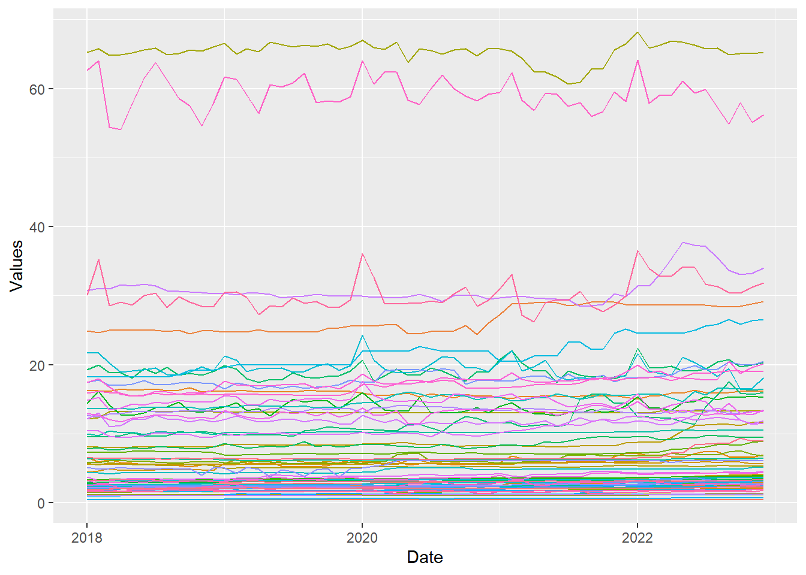
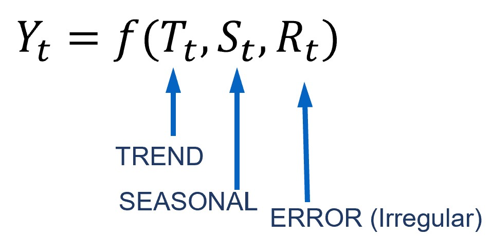
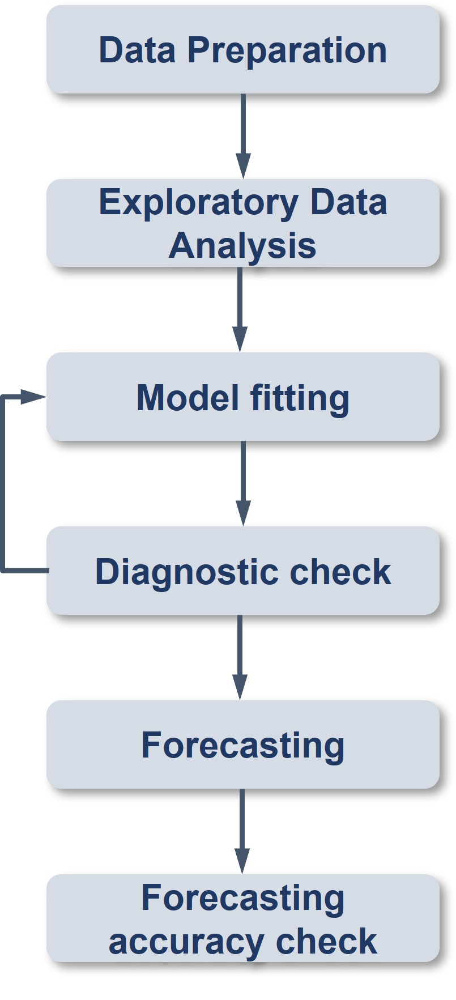

# 17.1 Learning Outcome

By the end of this hands-on exercise you will be able create the followings data visualisation by using R packages:

-   plotting a calender heatmap by using ggplot2 functions,

-   plotting a cycle plot by using ggplot2 function,

-   plotting a slopegraph

-   plotting a horizon chart

# 17.2 Getting Started

# 17.3 Do It Yourself

Write a code chunk to check, install and launch the following R packages: scales, viridis, lubridate, ggthemes, gridExtra, readxl, knitr, data.table and tidyverse.

```{R}
pacman::p_load(scales, viridis, lubridate, ggthemes, gridExtra, readxl, knitr, data.table, CGPfunctions, ggHoriPlot, tidyverse)
```

# 17.4 Plotting Calendar Heatmap

In this section, you will learn how to plot a calender heatmap programmatically by using ggplot2 package.


By the end of this section, you will be able to:

-   plot a calender heatmap by using ggplot2 functions and extension,

-   to write function using R programming,

-   to derive specific date and time related field by using base R and lubridate packages

-   to perform data preparation task by using tidyr and dplyr packages.

## 17.4.1 The Data

For the purpose of this hands-on exercise, *eventlog.csv* file will be used. This data file consists of 199,999 rows of time-series cyber attack records by country.

## 17.4.2 Importing the data

First, you will use the code chunk below to import *eventlog.csv* file into R environment and called the data frame as *attacks*.

```{r}
attacks <- read_csv("data/eventlog.csv")
```

## 17.4.3 Examining the data structure

It is always a good practice to examine the imported data frame before further analysis is performed.

For example, *kable()* can be used to review the structure of the imported data frame.

```{r}
kable(head(attacks))
```

There are three columns, namely *timestamp*, *source_country* and *tz*.

-   *timestamp* field stores date-time values in POSIXct format.

-   *source_country* field stores the source of the attack. It is in *ISO 3166-1 alpha-2* country code.

-   *tz* field stores time zone of the source IP address.

## 17.4.4 Data Preparation Step 1: Deriving weekday and hour of day fields

Before we can plot the calender heatmap, two new fields namely wkday and hour need to be derived. In this step, we will write a function to perform the task.

```{r}
make_hr_wkday <- function(ts, sc, tz) {
  real_times <- ymd_hms(ts, 
                        tz = tz[1], 
                        quiet = TRUE)
  dt <- data.table(source_country = sc,
                   wkday = weekdays(real_times),
                   hour = hour(real_times))
  return(dt)
  }
```

Step 2: Deriving the attacks tibble data frame

```{R}
wkday_levels <- c('Saturday', 'Friday', 
                  'Thursday', 'Wednesday', 
                  'Tuesday', 'Monday', 
                  'Sunday')

attacks <- attacks %>%
  group_by(tz) %>%
  do(make_hr_wkday(.$timestamp, 
                   .$source_country, 
                   .$tz)) %>% 
  ungroup() %>% 
  mutate(wkday = factor(
    wkday, levels = wkday_levels),
    hour  = factor(
      hour, levels = 0:23))
```

::: callout-note
Beside extracting the necessary data into attacks data frame, mutate() of dplyr package is used to convert wkday and hour fields into factor so they’ll be ordered when plotting Table below shows the tidy tibble table after processing.
:::

```{r}
kable(head(attacks))
```

## 17.4.5 Building the Calendar Heatmaps

```{R}
grouped <- attacks %>% 
  count(wkday, hour) %>% 
  ungroup() %>%
  na.omit()

ggplot(grouped, 
       aes(hour, 
           wkday, 
           fill = n)) + 
geom_tile(color = "white", 
          size = 0.1) + 
theme_tufte(base_family = "Helvetica") + 
coord_equal() +
scale_fill_gradient(name = "# of attacks",
                    low = "sky blue", 
                    high = "dark blue") +
labs(x = NULL, 
     y = NULL, 
     title = "Attacks by weekday and time of day") +
theme(axis.ticks = element_blank(),
      plot.title = element_text(hjust = 0.5),
      legend.title = element_text(size = 8),
      legend.text = element_text(size = 6) )
```

::: callout-tip
## Things to learn from the code chunk

-   This a tibble data table called *grouped* is derived by aggregating the attack by *wkday* and *hour* fields.

-   a new field called *n* is derived by using `group_by()` and `count()`functions.

-   `na.omit()` is used to exclude missing value.

-   `geom_tile()` is used to plot tiles (grids) at each x and y position. `color` and `size` arguments are used to specify the border color and line size of the tiles.

-   [`theme_tufte()`](https://jrnold.github.io/ggthemes/reference/theme_tufte.html) of [**ggthemes**](https://jrnold.github.io/ggthemes/reference/index.html) package is used to remove unnecessary chart junk. To learn which visual components of default ggplot2 have been excluded, you are encouraged to comment out this line to examine the default plot.

-   `coord_equal()` is used to ensure the plot will have an aspect ratio of 1:1.

-   `scale_fill_gradient()` function is used to creates a two colour gradient (low-high). an example of a callout with a title.
:::

Then we can simply group the count by hour and wkday and plot it, since we know that we have values for every combination there’s no need to further preprocess the data.

## 17.4.6 Building Multiple Calendar Heatmaps

**Challenge:** Building multiple heatmaps for the top four countries with the highest number of attacks.

## 17.4.7 Plotting Multiple Calendar Heatmaps

Step 1: Deriving attack by country object

In order to identify the top 4 countries with the highest number of attacks, you are required to do the followings:

-   count the number of attacks by country,

-   calculate the percent of attackes by country, and

-   save the results in a tibble data frame.

```{r}
attacks_by_country <- count(
  attacks, source_country) %>%
  mutate(percent = percent(n/sum(n))) %>%
  arrange(desc(n))
```

Step 2: Preparing the tidy data frame

In this step, you are required to extract the attack records of the top 4 countries from *attacks* data frame and save the data in a new tibble data frame (i.e. *top4_attacks*).

```{r}
top4 <- attacks_by_country$source_country[1:4]
top4_attacks <- attacks %>%
  filter(source_country %in% top4) %>%
  count(source_country, wkday, hour) %>%
  ungroup() %>%
  mutate(source_country = factor(
    source_country, levels = top4)) %>%
  na.omit()
```

## 17.4.8 Plotting Multiple Calendar Heatmaps

Step 3: Plotting the Multiple Calender Heatmap by using ggplot2 package.

```{r}
ggplot(top4_attacks, 
       aes(hour, 
           wkday, 
           fill = n)) + 
  geom_tile(color = "white", 
          size = 0.1) + 
  theme_tufte(base_family = "Helvetica") + 
  coord_equal() +
  scale_fill_gradient(name = "# of attacks",
                    low = "sky blue", 
                    high = "dark blue") +
  facet_wrap(~source_country, ncol = 2) +
  labs(x = NULL, y = NULL, 
     title = "Attacks on top 4 countries by weekday and time of day") +
  theme(axis.ticks = element_blank(),
        axis.text.x = element_text(size = 7),
        plot.title = element_text(hjust = 0.5),
        legend.title = element_text(size = 8),
        legend.text = element_text(size = 6) )
```

# 17.5 Plotting Cycle Plot

In this section, you will learn how to plot a cycle plot showing the time-series patterns and trend of visitor arrivals from Vietnam programmatically by using ggplot2 functions.

## 17.5.1 Step 1: Data Import

For the purpose of this hands-on exercise, *arrivals_by_air.xlsx* will be used.

The code chunk below imports *arrivals_by_air.xlsx* by using `read_excel()` of **readxl** package and save it as a tibble data frame called *air*.

```{r}
air <- read_excel("data/arrivals_by_air.xlsx")
```

## 17.5.2 Step 2: Deriving month and year fields

Next, two new fields called *month* and *year* are derived from *Month-Year* field.

```{r}
air$month <- factor(month(air$`Month-Year`), 
                    levels=1:12, 
                    labels=month.abb, 
                    ordered=TRUE) 
air$year <- year(ymd(air$`Month-Year`))
```

## 17.5.3 Step 4: Extracting the target country

Next, the code chunk below is use to extract data for the target country (i.e. Vietnam)

```{r}
Vietnam <- air %>% 
  select(`Vietnam`, 
         month, 
         year) %>%
  filter(year >= 2010)
```

## 17.5.4 Step 5: Computing year average arrivals by month

The code chunk below uses `group_by()` and `summarise()` of **dplyr**to compute year average arrivals by month.

```{r}
hline.data <- Vietnam %>% 
  group_by(month) %>%
  summarise(avgvalue = mean(`Vietnam`))
```

## 17.5.5 Step 6: Plotting the cycle plot

The code chunk below is used to plot the cycle plot as shown in Slide 12/23.

```{r}
ggplot() + 
  geom_line(data=Vietnam,
            aes(x=year, 
                y=`Vietnam`, 
                group=month), 
            colour="black") +
  geom_hline(aes(yintercept=avgvalue), 
             data=hline.data, 
             linetype=6, 
             colour="red", 
             size=0.5) + 
  facet_grid(~month) +
  labs(axis.text.x = element_blank(),
       title = "Visitor arrivals from Vietnam by air, Jan 2010-Dec 2019") +
  xlab("") +
  ylab("No. of Visitors") +
  theme_tufte(base_family = "Helvetica")
```

# 17.6 Plotting Slopegraph

In this section you will learn how to plot a [slopegraph](https://www.storytellingwithdata.com/blog/2020/7/27/what-is-a-slopegraph) by using R.

Before getting start, make sure that **CGPfunctions** has been installed and loaded onto R environment. Then, refer to [Using newggslopegraph](https://cran.r-project.org/web/packages/CGPfunctions/vignettes/Using-newggslopegraph.html)to learn more about the function. Lastly, read more about `newggslopegraph()` and its arguments by referring to this [link](https://www.rdocumentation.org/packages/CGPfunctions/versions/0.6.3/topics/newggslopegraph).

## 17.6.1 Step 1: Data Import

Import the rice data set into R environment by using the code chunk below.

```{r}
rice <- read_csv("data/rice.csv")
```

## 17.6.2 Step 2: Plotting the slopegraph

Next, code chunk below will be used to plot a basic slopegraph as shown below.

```{r}
rice %>% 
  mutate(Year = factor(Year)) %>%
  filter(Year %in% c(1961, 1980)) %>%
  newggslopegraph(Year, Yield, Country,
                Title = "Rice Yield of Top 11 Asian Counties",
                SubTitle = "1961-1980",
                Caption = "Prepared by: Bryan Chang Tze Kin")
```

::: callout-tip
## Things to learn from the code chunk above

For effective data visualisation design, `factor()` is used convert the value type of *Year* field from numeric to factor.
:::

=======

# 18  Time on the Horizon: ggHoriPlot methods

# 18.1 Overview

A horizon graph is an analytical graphical method specially designed for visualising large numbers of time-series. It aims to overcome the issue of visualising highly overlapping time-series as shown in the figure below.



A horizon graph essentially an area chart that has been split into slices and the slices then layered on top of one another with the areas representing the highest (absolute) values on top. Each slice has a greater intensity of colour based on the absolute value it represents.


In this section, you will learn how to plot a [horizon graph](http://www.perceptualedge.com/articles/visual_business_intelligence/time_on_the_horizon.pdf) by using [**ggHoriPlot**](https://rivasiker.github.io/ggHoriPlot/index.html)package.

::: callout-tip
## Tip

Before getting started, please visit [Getting Started](https://rivasiker.github.io/ggHoriPlot/articles/ggHoriPlot.html) to learn more about the functions of ggHoriPlot package. Next, read [`geom_horizon()`](https://rivasiker.github.io/ggHoriPlot/reference/geom_horizon.html) to learn more about the usage of its arguments.
:::

# 18.2 Getting started

Before getting start, make sure that **ggHoriPlot** has been included in the `pacman::p_load(...)` statement above.

```{R}
pacman::p_load(ggHoriPlot, ggthemes, tidyverse)
```

## 18.2.1 Step 1: Data Import

For the purpose of this hands-on exercise, [Average Retail Prices Of Selected Consumer Items](https://tablebuilder.singstat.gov.sg/table/TS/M212891) will be used.

Use the code chunk below to import the AVERP.csv file into R environment.

```{r}
averp <- read_csv("data/AVERP.csv") %>%
  mutate(`Date` = dmy(`Date`))
```

::: callout-tip
## Thing to learn from the code chunk above.

By default, read_csv will import data in Date field as Character data type. [`dmy()`](https://lubridate.tidyverse.org/reference/ymd.html) of [**lubridate**](https://lubridate.tidyverse.org/) package to palse the Date field into appropriate Date data type in R.
:::

## 18.2.2 Step 2: Plotting the horizon graph

Next, the code chunk below will be used to plot the horizon graph.

```{R}
averp %>% 
  filter(Date >= "2018-01-01") %>%
  ggplot() +
  geom_horizon(aes(x = Date, y=Values), 
               origin = "midpoint", 
               horizonscale = 6)+
  facet_grid(`Consumer Items`~.) +
    theme_few() +
  scale_fill_hcl(palette = 'RdBu') +
  theme(panel.spacing.y=unit(0, "lines"), strip.text.y = element_text(
    size = 5, angle = 0, hjust = 0),
    legend.position = 'none',
    axis.text.y = element_blank(),
    axis.text.x = element_text(size=7),
    axis.title.y = element_blank(),
    axis.title.x = element_blank(),
    axis.ticks.y = element_blank(),
    panel.border = element_blank()
    ) +
    scale_x_date(expand=c(0,0), date_breaks = "3 month", date_labels = "%b%y") +
  ggtitle('Average Retail Prices of Selected Consumer Items (Jan 2018 to Dec 2022)')
```

# 19  Visualising, Analysing and Forecasting Time-series Data: tidyverts methods

# 19.1 Learning Outcome

[tidyverts](https://tidyverts.org/) is a family of R packages specially designed for visualising, analysing and forecasting time-series data conforming to tidyverse framework. It is the work of [Dr. Rob Hyndman](https://robjhyndman.com/), professor of statistics at Monash University, and his team. The family of R packages are intended to be the next-generation replacement for the very popular [forecast](https://pkg.robjhyndman.com/forecast/) package, and is currently under active development.

The main reference for tidyverts is the textbook [Forecasting: Principles and Practice, 3rd Edition](https://otexts.com/fpp3/), by Hyndman and Athanasopoulos. It’s highly recommended to read that in conjunction with working through the notebooks here.

By the end of this session, you will be able to:

-   import and wrangling time-series data by using appropriate tidyverse methods,

-   visualise and analyse time-series data,

-   calibrate time-series forecasting models by using exponential smoothing and ARIMA techniques, and

-   compare and evaluate the performance of forecasting models.

# 19.2 Getting Started

For the purpose of this hands-on exercise, the following R packages will be used.

```{R}
pacman::p_load(tidyverse, tsibble, feasts, fable, seasonal)
```

-   [**lubridate**](https://lubridate.tidyverse.org/) provides a collection to functions to parse and wrangle time and date data.

-   tsibble, feasts, fable and fable.prophet are belong to [**tidyverts**](https://tidyverts.org/), a family of tidy tools for time series data handling, analysis and forecasting.

    -   [**tsibble**](https://tsibble.tidyverts.org/) provides a data infrastructure for tidy temporal data with wrangling tools. Adapting the tidy data principles, tsibble is a data- and model-oriented object.

    -   [**feasts**](https://feasts.tidyverts.org/) provides a collection of tools for the analysis of time series data. The package name is an acronym comprising of its key features: Feature Extraction And Statistics for Time Series.

## 19.2.1 Importing the data

First, `read_csv()` of **readr** package is used to import *visitor_arrivals_by_air.csv* file into R environment. The imported file is saved an tibble object called *ts_data*.

```{R}
ts_data <- read_csv(
  "data/visitor_arrivals_by_air.csv")
```

In the code chunk below, `dmy()` of **lubridate** package is used to convert data type of Month-Year field from Character to Date.

```{R}
ts_data$`Month-Year` <- dmy(
  ts_data$`Month-Year`)
```

## 19.2.2 Conventional base `ts` object versus `tibble`object

tibble object

```{R}
ts_data
```

## 19.2.3 Conventional base `ts` object versus `tibble`object

ts object

```{R}
ts_data_ts <- ts(ts_data)       
head(ts_data_ts)
```

## 19.2.4 Converting `tibble` object to `tsibble` object

Built on top of the tibble, a **tsibble** (or tbl_ts) is a data- and model-oriented object. Compared to the conventional time series objects in R, for example ts, zoo, and xts, the tsibble preserves time indices as the essential data column and makes heterogeneous data structures possible. Beyond the tibble-like representation, key comprised of single or multiple variables is introduced to uniquely identify observational units over time (index).

The code chunk below converting ts_data from tibble object into tsibble object by using [`as_tsibble()`](https://tsibble.tidyverts.org/reference/as-tsibble.html) of **tsibble** R package.

```{r}
ts_tsibble <- ts_data %>%
  mutate(Month = yearmonth(`Month-Year`)) %>%
  as_tsibble(index = `Month`)
```

What can we learn from the code chunk above? + [`mutate()`](https://r4va.netlify.app/chap19) of **dplyr** package is used to derive a new field by transforming the data values in Month-Year field into month-year format. The transformation is performed by using [`yearmonth()`](https://tsibble.tidyverts.org/reference/year-month.html) of **tsibble** package. + [`as_tsibble()`](https://tsibble.tidyverts.org/reference/as-tibble.html) is used to convert the tibble data frame into tsibble data frame.

## 19.2.5 tsibble object

```{R}
ts_tsibble
```

# 19.3 Visualising Time-series Data

In order to visualise the time-series data effectively, we need to organise the data frame from wide to long format by using [`pivot_longer()`](https://tidyr.tidyverse.org/reference/pivot_longer.html) of **tidyr** package as shown below.

```{r}
ts_longer <- ts_data %>%
  pivot_longer(cols = c(2:34),
               names_to = "Country",
               values_to = "Arrivals")
```

## 19.3.1 Visualising single time-series: ggplot2 methods

```{R}
ts_longer %>%
  filter(Country == "Vietnam") %>%
  ggplot(aes(x = `Month-Year`, 
             y = Arrivals))+
  geom_line(size = 0.5)
```

What can we learn from the code chunk above?

-   [`filter()`](https://dplyr.tidyverse.org/reference/filter.html) of [**dplyr**](https://dplyr.tidyverse.org/) package is used to select records belong to Vietnam.

-   [`geom_line()`](https://ggplot2.tidyverse.org/reference/geom_path.html) of [**ggplot2**](https://ggplot2.tidyverse.org/) package is used to plot the time-series line graph.

## 19.3.2 Plotting multiple time-series data with ggplot2 methods

```{R}
ggplot(data = ts_longer, 
       aes(x = `Month-Year`, 
           y = Arrivals,
           color = Country))+
  geom_line(size = 0.5) +
  theme(legend.position = "bottom", 
        legend.box.spacing = unit(0.5, "cm"))
```

In order to provide effective comparison, [`facet_wrap()`](https://ggplot2.tidyverse.org/reference/facet_wrap.html) of **ggplot2** package is used to create small multiple line graph also known as trellis plot.

```{r}
ggplot(data = ts_longer, 
       aes(x = `Month-Year`, 
           y = Arrivals))+
  geom_line(size = 0.5) +
  facet_wrap(~ Country,
             ncol = 3,
             scales = "free_y") +
  theme_bw()
```

# 19.4 Visual Analysis of Time-series Data

-   Time series datasets can contain a seasonal component.

-   This is a cycle that repeats over time, such as monthly or yearly. This repeating cycle may obscure the signal that we wish to model when forecasting, and in turn may provide a strong signal to our predictive models.

In this section, you will discover how to identify seasonality in time series data by using functions provides by **feasts** packages.

In order to visualise the time-series data effectively, we need to organise the data frame from wide to long format by using [`pivot_longer()`](https://tidyr.tidyverse.org/reference/pivot_longer.html) of **tidyr** package as shown below.

```{R}
tsibble_longer <- ts_tsibble %>%
  pivot_longer(cols = c(2:34),
               names_to = "Country",
               values_to = "Arrivals")
```

## 19.4.1 Visual Analysis of Seasonality with Seasonal Plot

A **seasonal plot** is similar to a time plot except that the data are plotted against the individual **seasons** in which the data were observed.

A season plot is created by using [`gg_season()`](https://feasts.tidyverts.org/reference/gg_season.html) of **feasts** package.

```{r}
tsibble_longer %>%
  filter(Country == "Italy" |
         Country == "Vietnam" |
         Country == "United Kingdom" |
         Country == "Germany") %>% 
  gg_season(Arrivals)
```

## 19.4.2 Visual Analysis of Seasonality with Cycle Plot

A **cycle plot** shows how a trend or cycle changes over time. We can use them to see seasonal patterns. Typically, a cycle plot shows a measure on the Y-axis and then shows a time period (such as months or seasons) along the X-axis. For each time period, there is a trend line across a number of years.

Figure below shows two time-series lines of visitor arrivals from Vietnam and Italy. Both lines reveal clear sign of seasonal patterns but not the trend.

```{r}
tsibble_longer %>%
  filter(Country == "Vietnam" |
         Country == "Italy") %>% 
  autoplot(Arrivals) + 
  facet_grid(Country ~ ., scales = "free_y")
```

In the code chunk below, cycle plots using [`gg_subseries()`](https://feasts.tidyverts.org/reference/gg_subseries.html) of feasts package are created. Notice that the cycle plots show not only seasonal patterns but also trend.

```{R}
tsibble_longer %>%
  filter(Country == "Vietnam" |
         Country == "Italy") %>% 
  gg_subseries(Arrivals)
```

# 19.5 Time series decomposition

Time series decomposition allows us to isolate structural components such as trend and seasonality from the time-series data.



## 19.5.1 Single time series decomposition

In **feasts** package, time series decomposition is supported by [`ACF()`](https://feasts.tidyverts.org/reference/ACF.html), `PACF()`, `CCF()`, [`feat_acf()`](https://feasts.tidyverts.org/reference/feat_acf.html), and [`feat_pacf()`](https://feasts.tidyverts.org/reference/feat_acf.html). The output can then be plotted by using `autoplot()` of **feasts** package.

In the code chunk below, `ACF()` of **feasts** package is used to plot the ACF curve of visitor arrival from Vietnam.

```{r}
tsibble_longer %>%
  filter(`Country` == "Vietnam") %>%
  ACF(Arrivals) %>% 
  autoplot()
```

In the code chunk below, `PACF()` of **feasts** package is used to plot the Partial ACF curve of visitor arrival from Vietnam.

```{r}
tsibble_longer %>%
  filter(`Country` == "Vietnam") %>%
  PACF(Arrivals) %>% 
  autoplot()
```

## 19.5.2 Multiple time-series decomposition

Code chunk below is used to prepare a trellis plot of ACFs for visitor arrivals from Vietnam, Italy, United Kingdom and China.

```{r}
tsibble_longer %>%
  filter(`Country` == "Vietnam" |
         `Country` == "Italy" |
         `Country` == "United Kingdom" |
         `Country` == "China") %>%
  ACF(Arrivals) %>%
  autoplot()
```

On the other hand, code chunk below is used to prepare a trellis plot of PACFs for visitor arrivals from Vietnam, Italy, United Kingdom and China.

```{r}
tsibble_longer %>%
  filter(`Country` == "Vietnam" |
         `Country` == "Italy" |
         `Country` == "United Kingdom" |
         `Country` == "China") %>%
  PACF(Arrivals) %>%
  autoplot()
```

## 19.5.3 Composite plot of time series decomposition

One of the interesting function of feasts package time series decomposition is [`gg_tsdisplay()`](https://feasts.tidyverts.org/reference/gg_tsdisplay.html). It provides a composite plot by showing the original line graph on the top pane follow by the ACF on the left and seasonal plot on the right.

```{R}
tsibble_longer %>%
  filter(`Country` == "Vietnam") %>%
  gg_tsdisplay(Arrivals)
```

# 19.6 Visual STL Diagnostics

STL is an acronym for “Seasonal and Trend decomposition using Loess”, while Loess is a method for estimating nonlinear relationships. It was developed by R. B. Cleveland, Cleveland, McRae, & Terpenning (1990).

STL is a robust method of time series decomposition often used in economic and environmental analyses. The STL method uses locally fitted regression models to decompose a time series into trend, seasonal, and remainder components.

The STL algorithm performs smoothing on the time series using LOESS in two loops; the inner loop iterates between seasonal and trend smoothing and the outer loop minimizes the effect of outliers. During the inner loop, the seasonal component is calculated first and removed to calculate the trend component. The remainder is calculated by subtracting the seasonal and trend components from the time series.

STL has several advantages over the classical, SEATS and X11 decomposition methods:

-   Unlike SEATS and X11, STL will handle any type of seasonality, not only monthly and quarterly data.

-   The seasonal component is allowed to change over time, and the rate of change can be controlled by the user.

-   The smoothness of the trend-cycle can also be controlled by the user.

-   It can be robust to outliers (i.e., the user can specify a robust decomposition), so that occasional unusual observations will not affect the estimates of the trend-cycle and seasonal components. They will, however, affect the remainder component.

## 19.6.1 Visual STL diagnostics with feasts

In the code chunk below, `STL()` of **feasts** package is used to decomposite visitor arrivals from Vietnam data.

```{r}
tsibble_longer %>%
  filter(`Country` == "Vietnam") %>%
  model(stl = STL(Arrivals)) %>%
  components() %>%
  autoplot()
```

The grey bars to the left of each panel show the relative scales of the components. Each grey bar represents the same length but because the plots are on different scales, the bars vary in size. The large grey bar in the bottom panel shows that the variation in the remainder component is smallest compared to the variation in the data. If we shrank the bottom three panels until their bars became the same size as that in the data panel, then all the panels would be on the same scale.

### 19.6.2 Classical Decomposition with feasts

In the code chunk below, `classical_decomposition()` of **feasts** package is used to decompose a time series into seasonal, trend and irregular components using moving averages. THe function is able to deal with both additive or multiplicative seasonal component.

```{R}
tsibble_longer %>%
  filter(`Country` == "Vietnam") %>%
  model(
    classical_decomposition(
      Arrivals, type = "additive")) %>%
  components() %>%
  autoplot()
```

# 19.7 Visual Forecasting

In this section, two R packages belong to tidyverts family will be used they are:

-   [**fable**](https://lubridate.tidyverse.org/) provides a collection of commonly used univariate and multivariate time series forecasting models including exponential smoothing via state space models and automatic ARIMA modelling. It is a tidy version of the popular [**forecast**](https://cran.r-project.org/web/packages/forecast/index.html) package and a member of [**tidyverts**](https://tidyverts.org/).

-   [**fabletools**](https://fabletools.tidyverts.org/) provides tools for building modelling packages, with a focus on time series forecasting. This package allows package developers to extend fable with additional models, without needing to depend on the models supported by fable.

Figure below shows a typical flow of a time-series forecasting process.



## 19.7.1 Time Series Data Sampling

A good practice in forecasting is to split the original data set into a training and a hold-out data sets. The first part is called **estimate sample** (also known as training data). It will be used to estimate the starting values and the smoothing parameters. This sample typically contains 75-80 percent of the observation, although the forecaster may choose to use a smaller percentage for longer series.

The second part of the time series is called **hold-out sample**. It is used to check the forecasting performance. No matter how many parameters are estimated with the estimation sample, each method under consideration can be evaluated with the use of the “new” observation contained in the hold-out sample.


In this example we will use the last 12 months for hold-out and the rest for training.

First, an extra column called *Type* indicating training or hold-out will be created by using `mutate()` of **dplyr** package. It will be extremely useful for subsequent data visualisation.

```{r}
vietnam_ts <- tsibble_longer %>%
  filter(Country == "Vietnam") %>% 
  mutate(Type = if_else(
    `Month-Year` >= "2019-01-01", 
    "Hold-out", "Training"))
```

Next, a training data set is extracted from the original data set by using `filter()` of **dplyr** package.

```{R}
vietnam_train <- vietnam_ts %>%
  filter(`Month-Year` < "2019-01-01")
```

## 19.7.2 Exploratory Data Analysis (EDA): Time Series Data

Before fitting forecasting models, it is a good practice to analysis the time series data by using EDA methods.

```{r}
vietnam_train %>%
  model(stl = STL(Arrivals)) %>%
  components() %>%
  autoplot()
```

## 19.7.3 Fitting forecasting models

### 19.7.3.1 Fitting Exponential Smoothing State Space (ETS) Models: fable methods

In fable, Exponential Smoothing State Space Models are supported by [`ETS()`](https://fable.tidyverts.org/reference/ETS.html). The combinations are specified through the formula:

ETS(y \~ error(c("A", "M")) + trend(c("N", "A", "Ad")) + season(c("N", "A", "M"))

#### 19.7.3.2 Fitting a simple exponential smoothing (SES)

```{r}
fit_ses <- vietnam_train %>%
  model(ETS(Arrivals ~ error("A") 
            + trend("N") 
            + season("N")))
fit_ses
```

Notice that `model()` of fable package is used to estimate the ETS model on a particular dataset, and returns a **mable** (model table) object.

A mable contains a row for each time series (uniquely identified by the key variables), and a column for each model specification. A model is contained within the cells of each model column.

### 19.7.3.3 Examine Model Assumptions

Next, `gg_tsresiduals()` of **feasts** package is used to check the model assumptions with residuals plots.

```{R}
gg_tsresiduals(fit_ses)
```

### 19.7.3.4 The model details

[`report()`](https://fabletools.tidyverts.org/reference/report.html) of fabletools is be used to reveal the model details.

```{r}
fit_ses %>%
  report()
```

### 19.7.3.5 Fitting ETS Methods with Trend: Holt’s Linear

### 19.7.3.6 Trend methods

```{R}
vietnam_H <- vietnam_train %>%
  model(`Holt's method` = 
          ETS(Arrivals ~ error("A") +
                trend("A") + 
                season("N")))
vietnam_H %>% report()
```

### 19.7.3.7 Damped Trend methods

```{R}
vietnam_HAd <- vietnam_train %>%
  model(`Holt's method` = 
          ETS(Arrivals ~ error("A") +
                trend("Ad") + 
                season("N")))
vietnam_HAd %>% report()
```

### 19.7.3.8 Checking for results

Check the model assumptions with residuals plots.

```{R}
gg_tsresiduals(vietnam_H)
```

```{R}
gg_tsresiduals(vietnam_HAd)
```

## 19.7.4 Fitting ETS Methods with Season: Holt-Winters

```{R}
Vietnam_WH <- vietnam_train %>%
  model(
    Additive = ETS(Arrivals ~ error("A") 
                   + trend("A") 
                   + season("A")),
    Multiplicative = ETS(Arrivals ~ error("M") 
                         + trend("A") 
                         + season("M"))
    )

Vietnam_WH %>% report()
```

## 19.7.5 Fitting multiple ETS Models

```{r}
fit_ETS <- vietnam_train %>%
  model(`SES` = ETS(Arrivals ~ error("A") + 
                      trend("N") + 
                      season("N")),
        `Holt`= ETS(Arrivals ~ error("A") +
                      trend("A") +
                      season("N")),
        `damped Holt` = 
          ETS(Arrivals ~ error("A") +
                trend("Ad") + 
                season("N")),
        `WH_A` = ETS(
          Arrivals ~ error("A") + 
            trend("A") + 
            season("A")),
        `WH_M` = ETS(Arrivals ~ error("M") 
                         + trend("A") 
                         + season("M"))
  )
```

## 19.7.6 The model coefficient

[`tidy()`](https://r4va.netlify.app/chap19) of fabletools is be used to extract model coefficients from a mable.

```{R}
fit_ETS %>%
  tidy()
```

## 19.7.7 Step 4: Model Comparison

`glance()` of fabletool

```{R}
fit_ETS %>% 
  report()
```

## 19.7.8 Step 5: Forecasting future values

To forecast the future values, `forecast()` of fable will be used. Notice that the forecast period is 12 months.

```{R}
fit_ETS %>%
  forecast(h = "12 months") %>%
  autoplot(vietnam_ts, 
           level = NULL)
```

## 19.7.9 Fitting ETS Automatically

```{r}
fit_autoETS <- vietnam_train %>%
  model(ETS(Arrivals))
fit_autoETS %>% report()
```

## 19.7.10 Fitting Fitting ETS Automatically

Next, we will check the model assumptions with residuals plots by using `gg_tsresiduals()` of **feasts** package

```{r}
gg_tsresiduals(fit_autoETS)
```

## 19.7.11 Forecast the future values

In the code chunk below, `forecast()` of **fable** package is used to forecast the future values. Then, `autoplot()` of **feasts** package is used to see the training data along with the forecast values.

```{R}
fit_autoETS %>%
  forecast(h = "12 months") %>%
  autoplot(vietnam_train)
```

## 19.7.12 Visualising AutoETS model with ggplot2

There are time that we are interested to visualise relationship between training data and fit data and forecasted values versus the hold-out data.

## 19.7.13 Visualising AutoETS model with ggplot2

Code chunk below is used to create the data visualisation in previous slide.

```{r}
fc_autoETS <- fit_autoETS %>%
  forecast(h = "12 months")

vietnam_ts %>%
  ggplot(aes(x=`Month`, 
             y=Arrivals)) +
  autolayer(fc_autoETS, 
            alpha = 0.6) +
  geom_line(aes(
    color = Type), 
    alpha = 0.8) + 
  geom_line(aes(
    y = .mean, 
    colour = "Forecast"), 
    data = fc_autoETS) +
  geom_line(aes(
    y = .fitted, 
    colour = "Fitted"), 
    data = augment(fit_autoETS))
```

# 19.8 AutoRegressive Integrated Moving Average(ARIMA) Methods for Time Series Forecasting: fable (tidyverts) methods

## 19.8.1 Visualising Autocorrelations: feasts methods

**feasts** package provides a very handy function for visualising ACF and PACF of a time series called [`gg_tsdiaply()`](https://feasts.tidyverts.org/reference/gg_tsdisplay.html).

```{r}
vietnam_train %>%
  gg_tsdisplay(plot_type='partial')
```

## 19.8.2 Visualising Autocorrelations: feasts methods

```{R}
tsibble_longer %>%
  filter(`Country` == "Vietnam") %>%
  ACF(Arrivals) %>% 
  autoplot()
```

```{r}
tsibble_longer %>%
  filter(`Country` == "United Kingdom") %>%
  ACF(Arrivals) %>% 
  autoplot()
```

By comparing both ACF plots, it is clear that visitor arrivals from United Kingdom were very seasonal and relatively weaker trend as compare to visitor arrivals from Vietnam.

## 19.8.3 Differencing: fable methods

### 19.8.3.1 Trend differencing

```{r}
tsibble_longer %>%
  filter(Country == "Vietnam") %>%
  gg_tsdisplay(difference(
    Arrivals,
    lag = 1), 
    plot_type='partial')
```

### 19.8.3.2 Seasonal differencing\*\*

```{r}
tsibble_longer %>%
  filter(Country == "Vietnam") %>%
  gg_tsdisplay(difference(
    Arrivals,
    difference = 12), 
    plot_type='partial')
```

The PACF is suggestive of an AR(1) model; so an initial candidate model is an ARIMA(1,1,0). The ACF suggests an MA(1) model; so an alternative candidate is an ARIMA(0,1,1).

## 19.8.4 Fitting ARIMA models manually: fable methods

```{R}
fit_arima <- vietnam_train %>%
  model(
    arima200 = ARIMA(Arrivals ~ pdq(2,0,0)),
    sarima210 = ARIMA(Arrivals ~ pdq(2,0,0) + 
                        PDQ(2,1,0))
    )
report(fit_arima)
```

## 19.8.5 Fitting ARIMA models automatically: fable methods

```{r}
fit_autoARIMA <- vietnam_train %>%
  model(ARIMA(Arrivals))
report(fit_autoARIMA)
```

## 19.8.6 Model Comparison

```{r}
bind_rows(
    fit_autoARIMA %>% accuracy(),
    fit_autoETS %>% accuracy(),
    fit_autoARIMA %>% 
      forecast(h = 12) %>% 
      accuracy(vietnam_ts),
    fit_autoETS %>% 
      forecast(h = 12) %>% 
      accuracy(vietnam_ts)) %>%
  select(-ME, -MPE, -ACF1)
```

## 19.8.7 Forecast Multiple Time Series

In this section, we will perform time series forecasting on multiple time series at one goal. For the purpose of the hand-on exercise, visitor arrivals from five selected ASEAN countries will be used.

First, `filter()` is used to extract the selected countries’ data.

```{r}
ASEAN <- tsibble_longer %>%
  filter(Country == "Vietnam" |
         Country == "Malaysia" |
         Country == "Indonesia" |
         Country == "Thailand" |
         Country == "Philippines")
```

Next, `mutate()` is used to create a new field called Type and populates their respective values. Lastly, `filter()` is used to extract the training data set and save it as a tsibble object called *ASEAN_train*.

```{r}
ASEAN_train <- ASEAN %>%
  mutate(Type = if_else(
    `Month-Year` >= "2019-01-01", 
    "Hold-out", "Training")) %>%
  filter(Type == "Training")
```

## 19.8.8 Fitting Mulltiple Time Series

In the code chunk below auto ETS and ARIMA models are fitted by using `model()`.

```{r}
ASEAN_fit <- ASEAN_train %>%
  model(
    ets = ETS(Arrivals),
    arima = ARIMA(Arrivals)
  )
```

## 19.8.9 Examining Models

The `glance()` of **fabletools** provides a one-row summary of each model, and commonly includes descriptions of the model’s fit such as the residual variance and information criteria.

```{r}
ASEAN_fit %>%
  glance()
```

**Be wary though**, as information criteria (AIC, AICc, BIC) are only comparable between the same model class and only if those models share the same response (after transformations and differencing).

## 19.8.10 Extracintg fitted and residual values

The fitted values and residuals from a model can obtained using fitted() and residuals() respectively. Additionally, the augment() function may be more convenient, which provides the original data along with both fitted values and their residuals.

```{R}
ASEAN_fit %>%
  augment()
```

## 19.8.11 Comparing Fit Models

In the code chunk below, `accuracy()` is used to compare the performances of the models.

```{r}
ASEAN_fit %>%
  accuracy() %>%
  arrange(Country)
```

## 19.8.12 Forecast Future Values

Forecasts from these models can be produced directly as our specified models do not require any additional data.

```{r}
ASEAN_fc <- ASEAN_fit %>%
  forecast(h = "12 months")
```

## 19.8.13 Visualising the forecasted values

In the code chunk below `autoplot()` of feasts package is used to plot the raw and fitted values.

```{r}
ASEAN_fc %>%
  autoplot(ASEAN)
```

# 20  Visualising, Analysing and Forecasting Time-series Data: timetk and modeltime method**s**

# 20.1 Learning Outcome

In this chapter, you will learn how to use timetk and model time packages to visualise, analyse and forescast time-series data. timetk provides a collection of functions for visualising and analysing time-series data. On the other hands, modeltime provides a collection of functions for time-series forecasting, both statistical learning and machine learning methods including deep learning and netsted forecasting methods.

In this topic, we are going to explore the tidymodels approach in time series forecasting.

-   import and wrangling time-series data by using appropriate tidyverse methods,

-   visualise and analyse time-series data,

-   calibrate time-series forecasting models by using exponential smoothing and ARIMA techniques, and

-   compare and evaluate the performance of forecasting models.

# 20.2 Setting Up R Environment

For the purpose of this hands-on exercise, the following R packages will be used.

```{r}
pacman::p_load(tidyverse, tidymodels, 
               timetk, modeltime)
```

-   [**tidyverse**](https://lubridate.tidyverse.org/) provides a collection of commonly used functions for importing, wrangling and visualising data. In this hands-on exercise the main packages used are readr, dplyr, tidyr and ggplot2.

-   [**modeltime**](https://business-science.github.io/modeltime/index.html) a new time series forecasting package designed to speed up model evaluation, selection, and forecasting. modeltime does this by integrating the [**tidymodels**](https://www.tidymodels.org/) machine learning ecosystem of packages into a streamlined workflow for tidyverse forecasting.

# 20.3 Introducing modeltime workflow

# 20.4 The data

In this sharing, [**Store Sales - Time Series Forecasting: Use machine learning to predict grocery sales**](https://www.kaggle.com/competitions/store-sales-time-series-forecasting/overview) from Kaggle competition will be used. For the purpose of this sharing, the main data set used is *train.csv*. It consists of six columns. They are:

-   *id* contains unique id for each records.

-   *date* gives the sales dates.

-   *store_nbr* identifies the store at which the products are sold.

-   *family* identifies the type of product sold.

-   *sales* gives the total sales for a product family at a particular store at a given date. Fractional values are possible since products can be sold in fractional units (1.5 kg of cheese, for instance, as opposed to 1 bag of chips).

-   *onpromotion* gives the total number of items in a product family that were being promoted at a store at a given date.

For the purpose of this sharing, I will focus of grocery sales instead of all products. Code chunk below is used to extract grocery sales from *train.csv* and saved the output into an rds file format for subsequent used.

<div>

## Code used

store_sales \<- read_csv( "data/store_sales/train.csv") %\>% filter(family == "GROCERY I") %\>% write_rds("data/store_sales/grocery.rds")

</div>

# 20.5 Time Series Forecasting Process

-   Collect data and split into training and test sets

-   Create & Fit Multiple Models

-   Add fitted models to a Model Table

-   Calibrate the models to a testing set.

-   Perform Testing Set Forecast & Accuracy Evaluation

-   Refit the models to Full Dataset & Forecast Forward

## 20.5.1 Step 1: Data Import and Sampling

In the code chunk below, `read_rds()` of **readr** package is used to import both data sets into R environment.

```{r}
grocery <- read_rds(
  "data/store_sales/grocery.rds") %>%
  mutate(across(c(1, 3, 4), 
                as.factor)) %>%
  group_by(family, date) %>%
  summarise(sum_sales = sum(sales)) %>%
  ungroup()
```

Optionally, you can also import the rest of the data sets provided at Kaggle by using the code chunk below.

```{r}
holidays_events <- read_csv(
  "data/store_sales/holidays_events.csv")
oil <- read_csv(
  "data/store_sales/oil.csv")
stores <- read_csv(
  "data/store_sales/stores.csv")
transactions <- read_csv(
  "data/store_sales/transactions.csv")
```

## 20.5.2 Step 1: Data Import and Sampling

*grocery* tibble data frame consists of 1684 days of daily sales data starts from 1st January 2013. We will split the data set into training and hold-out data sets by using [`initial_time_split()`](https://rsample.tidymodels.org/reference/initial_split.html) of [**rsample**](https://rsample.tidymodels.org/) package, a member of the tidymodels family.

```{r}
splits <- grocery %>%
  initial_time_split(prop = 0.955)
```

For checking purposes, the code chunk below can be used save the split sample data sets into *training* and *holdout* tibble data tables respectively.

```{r}
training <- training(splits)
holdout <- testing(splits)
```

## 20.5.3 Step 2: Create & Fit Multiple Models

In this step, we will build and fit four models using the code chunks below:

**Model 1: Exponential Smoothing (Modeltime)**

An Error-Trend-Season (ETS) model by using `exp_smoothing()`.

```{r}
model_fit_ets <- exp_smoothing() %>%
    set_engine(engine = "ets") %>%
    fit(sum_sales ~ `date`, 
        data = training(splits))
```

**Model 2: Auto ARIMA (Modeltime)**

An auto ARIMA model by using `arima_reg()`.

```{r}
model_fit_arima <- arima_reg() %>%
  set_engine(engine = "auto_arima") %>%
  fit(sum_sales ~ `date`, 
      data = training(splits))
```

**Model 3: Boosted Auto ARIMA (Modeltime)**

An Boosted auto ARIMA model by using `arima_boost()`.

```{r}
model_fit_arima_boosted <- arima_boost(
  min_n = 2,
  learn_rate = 0.015) %>%
  set_engine(
    engine = "auto_arima_xgboost") %>%
  fit(sum_sales ~ `date`, 
      data = training(splits))
```

**Model 4: prophet (Modeltime)**

A prophet model using `prophet_reg()`.

```{r}
model_fit_prophet <- prophet_reg() %>%
  set_engine(engine = "prophet") %>%
  fit(sum_sales ~ `date`, 
      data = training(splits))
```

## 20.5.4 Step 3: Add fitted models to a Model Table

Next, modeltime_table() of modeltime package is used to add each of the models to a Modeltime Table.

```{r}
models_tbl <- modeltime_table(
  model_fit_ets,
  model_fit_arima,
  model_fit_arima_boosted,
  model_fit_prophet)

models_tbl
```

## 20.5.5 Step 4 - Calibrate the model to a testing set

In the code chunk below, [`modeltime_caibrate()`](https://business-science.github.io/modeltime/reference/modeltime_calibrate.html) is used to add a new column called *.calibrate_data* into the newly *created models_tbl* tibble data table.

```{r}
calibration_tbl <- models_tbl %>%
    modeltime_calibrate(new_data = testing(splits))

calibration_tbl
```

Note that Calibration Data is simply forecasting predictions and residuals that are calculated from the hold-out data (also know as test data in machine learning)

## 20.5.6 Step 5: Model Accuracy Assessment

In general, there are two ways to assess accuracy of the models. They are by means of accuracy metrics or visualisation.

In the code chunk below, [`modeltime_accuracy()`](https://business-science.github.io/modeltime/reference/modeltime_accuracy.html) of modeltime package is used compute the accuracy metrics. Then, [`table_modeltime_accuracy()`](https://business-science.github.io/modeltime/reference/table_modeltime_accuracy.html) is used to present the accuracy metrics in tabular form.

```{r}
calibration_tbl %>%
  modeltime_accuracy %>%
  table_modeltime_accuracy(
    .interactive = FALSE)
```

Visualizing the Test Error is easy to do using the interactive plotly visualization (just toggle the visibility of the models using the Legend).

```{r}
calibration_tbl %>%
  modeltime_forecast(
    new_data = testing(splits),
    actual_data = grocery) %>%
  plot_modeltime_forecast(
    .legend_max_width = 25, 
    .interactive = TRUE,
    .plotly_slider = TRUE)
```

## 20.5.7 Step 6 - Refit to Full Dataset & Forecast Forward

The final step is to refit the models to the full dataset using [`modeltime_refit()`](https://business-science.github.io/modeltime/reference/modeltime_refit.html)and forecast them forward.

The code chunk below uses modeltime_refit() to refit the forecasting models with the full data.

```{R}
refit_tbl <- calibration_tbl %>%
    modeltime_refit(data = grocery)
```

Then, `modeltime_forecast()` is used to forecast to a selected future time period, in this example 6 weeks.

```{r}
forecast_tbl <- refit_tbl %>%
  modeltime_forecast(
    h = "6 weeks",
    actual_data = grocery,
    keep_data = TRUE) 
```

Notice that this newly derived *forecast_tbl* consists of 1852 rows (1684 rows for the original grocery sales data plus 7 days x 6 weeks x 4 models forecasted data)

```{R}
forecast_tbl %>%
  plot_modeltime_forecast(
    .legend_max_width = 25, 
    .interactive = TRUE,
    .plotly_slider = TRUE)
```

Let us also examine the model accuracy metrics after refitting the full data set.

```{r}
refit_tbl %>%
  modeltime_accuracy() %>%
  table_modeltime_accuracy(
    .interactive = FALSE)
```
