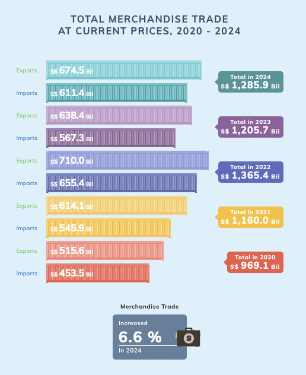
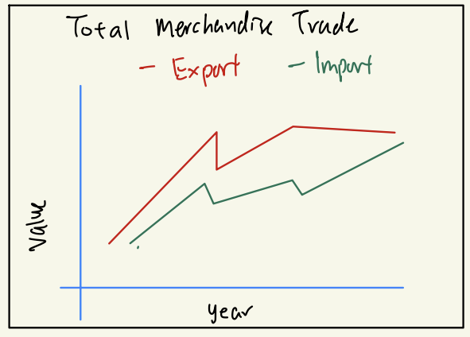
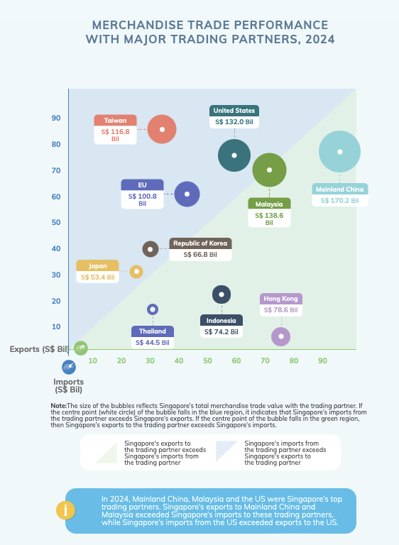
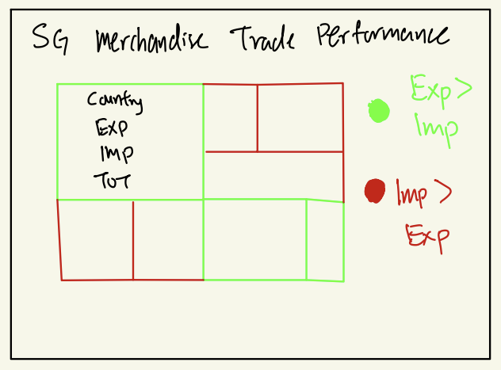
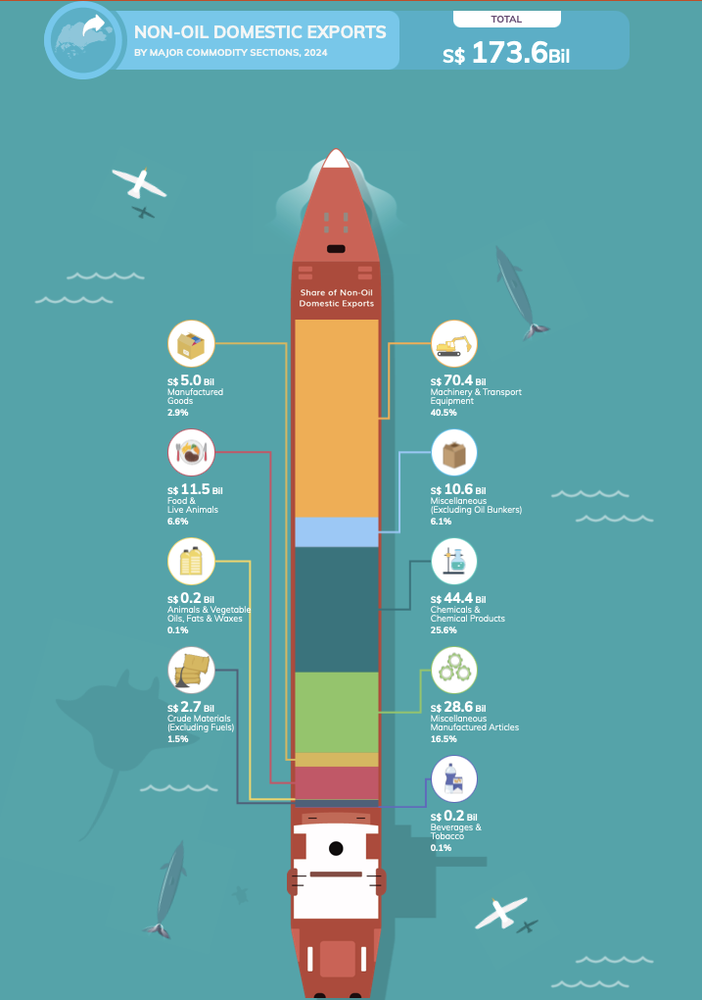
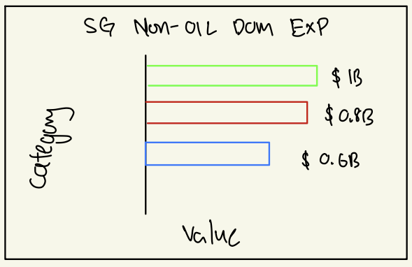

# 1 Overview

Since Mr. Donald Trump took office as the President of the United States on January 20, 2025, one of the most closely watched topics has been global trade.

As a visual analytics novice, you are eager to apply newly acquired techniques to explore and analyze the changing trends and patterns of Singapore’s international trade since 2015.

# 2 Task

For this take home exercise, we will select three visualizations from [this page](https://www.singstat.gov.sg/modules/infographics/singapore-international-trade), comment on the pros and cons, provide sketches of the makeover and create the makeover using appropriate ggplot2 and other packages.

Then, we will analyse the [Merchandise Trade by Region/Market](https://www.singstat.gov.sg/find-data/search-by-theme/trade-and-investment/merchandise-trade/latest-data) data set from the [Department of Statistics Singapore](https://www.singstat.gov.sg/) website and analyse the data with either time-series analysis with appropriate data visualization methods and R packages.

# 3 Getting Started

## 3.1 Importing Packages

| Library      | Use Case                                           |
|--------------|----------------------------------------------------|
| readr        | to import our data set using read_csv()            |
| dplyr        | data cleaning, filtering, summarizing, aggregating |
| tidyr        | data reshape                                       |
| ggplot2      | data visualization                                 |
| ggrepel      | customizing visualizations in ggplot2              |
| ggtext       | customizing visualizations in ggplot2              |
| treemapify   | creating tree maps                                 |
| CGPfunctions | creating slope graph                               |

```{r}
pacman::p_load(readr, dplyr, tidyr, 
               ggplot2, ggrepel, ggtext, 
               treemapify, CGPfunctions)

```

## 3.2 Data set

The data sets imported are the 3 data sets within the [Merchandise Trade by Region/Market](https://www.singstat.gov.sg/find-data/search-by-theme/trade-and-investment/merchandise-trade/latest-data) as mentioned above, this includes Domestic, Reexport and Import data. On top of that we also imported an additional [Merchandise Trade by Commodity Section](https://tablebuilder.singstat.gov.sg/table/TS/M451001) Dataset as we will be evaluating one of the visualizations from this domain.

```{r}
dom_data <- read_csv("data/domexports.csv", col_names = TRUE)
re_data  <- read_csv("data/reexports.csv", col_names = TRUE)
imp_data <- read_csv("data/imports.csv", col_names = TRUE)
nodx_data <- read_csv("data/nonoilexport.csv", col_names = TRUE)


```

# 4 Data Vis Makeover

## 4.1 Total Merchandise Trade at Current Prices, 2020-2024

This visualization shows the Total Merchandise Trade at Current Prices, 2020-2024 using a Bar Chart.



### What is good about this bar chart?

1.  It is very engaging and thematic with the use of container graphics making the chart rather visually appealing aesthetically.
2.  There is clear distinction between Exports and Imports as each bar is labelled explicitly
3.  The total trade value for each year is highlighted in a labelled box next to the bar chart
4.  All Information are present, the value of Total Export by Year and Total Import by Year and Total Export and Import by year.

### Why it is bad?

1.  It is overloaded with visual elements, although the graphics, icons and text boxes helps with the aesthetics, it may be unnecessary cluttered.
2.  It is difficult to compare the trends between the years and only works well for a single-year analysis
3.  The information are scattered everywhere, for example, if I want to compare the years between export I have to look vertically skipping the import charts in between and if I want to identify the year I have to look at the labeled text box on the right.

### The Sketch



### The Plot

```{r}
#| code-fold: true
#| code-summary: "Show the code"
total_markets_row <- "Total All Markets"
dom_idx <- which(dom_data$`Data Series` == total_markets_row)
re_idx  <- which(re_data$`Data Series`  == total_markets_row)
imp_idx <- which(imp_data$`Data Series` == total_markets_row)

dom_values <- as.numeric(dom_data[dom_idx, -1])
re_values  <- as.numeric(re_data[re_idx, -1])
imp_values <- as.numeric(imp_data[imp_idx, -1])

total_exp_values <- dom_values + re_values

months <- colnames(dom_data)[-1]
year_part <- as.numeric(substr(months, 1, 4))

df_yearly <- data.frame(
  Year          = year_part,
  Total_Exports = total_exp_values,
  Total_Imports = imp_values
) %>%
  group_by(Year) %>%
  summarise(
    Total_Exports = sum(Total_Exports, na.rm = TRUE),
    Total_Imports = sum(Total_Imports, na.rm = TRUE)
  ) %>%
  filter(Year >= 2020 & Year <= 2024)

df_yearly <- df_yearly %>%
  mutate(Total_Trade = Total_Exports + Total_Imports)

color_map <- c(
  "Total Exports"            = "#61A5C2",
  "Total Imports"            = "#B38B6D"
)

p <- ggplot(df_yearly, aes(x = Year)) +
  geom_line(
    aes(y = pmin(Total_Exports / 1e3, 1000), color = "Total Exports"), 
    size = 1.5
  ) +
  geom_line(
    aes(y = pmin(Total_Imports / 1e3, 1000), color = "Total Imports"), 
    size = 1.5
  ) +
  
  geom_point(
    aes(y = pmin(Total_Exports / 1e3, 1000), color = "Total Exports"), 
    size = 3
  ) +
  geom_point(
    aes(y = pmin(Total_Imports / 1e3, 1000), color = "Total Imports"), 
    size = 3
  ) +
  
  labs(
    title    = "Total Merchandise Trade (2020 - 2024)",
    subtitle = "Annual Figures in Billions (S$) at Current Prices",
    x        = "Year", 
    y        = "Trade Value (S$ Billion)",
    color    = "Legend"
  ) +
  
  scale_x_continuous(breaks = seq(2020, 2024, 1)) +
  scale_y_continuous(
    limits = c(400, 800),
    breaks = seq(400, 800, 100),
    labels = scales::comma_format()
  ) +
  
  scale_color_manual(
    breaks = c("Total Exports", "Total Imports"),
    values = color_map,
    name   = "Legend",
    labels = c(
      "Total Exports"            = "Total Exports",
      "Total Imports"            = "Total Imports"
    )
  ) +
  
  theme_minimal(base_size = 14) +
  theme(
    plot.background  = element_rect(fill = "#F5F5F2", color = NA),
    panel.background = element_rect(fill = "#F5F5F2", color = NA),
    plot.title       = element_text(face = "bold", size = 18, hjust = 0.5),
    plot.subtitle    = element_text(size = 12, hjust = 0.5, color = "gray40"),
    legend.position  = "top",
    legend.title     = element_text(size = 12, face = "bold"),
    legend.text      = element_text(size = 10),
    axis.text.x      = element_text(size = 10),
    axis.text.y      = element_text(size = 10),
    axis.title.x     = element_text(size = 12, face = "bold"),
    axis.title.y     = element_text(size = 12, face = "bold")
  )

p + geom_text_repel(
    data = df_yearly,
    aes(
      x     = Year,
      y     = pmin(Total_Exports / 1e3, 1000),
      label = round(Total_Trade / 1e3, 1), 
      color = "#9467bd"
      ),
    size = 4,
    fontface = "bold",
    box.padding = 0.4,
    point.padding = 0.5,
    segment.color = NA, 
    vjust = -5, 
    show.legend = FALSE
  )
```

The makeover improved visualization shows all the important information as in the original visualization through a line chart using ggplot geom_line for the plot, theme_minimal() and geom_text_repel() for the customization and aesthetics.

### Why is it better?

1.  The line chart makes it easy to see the trend of how exports and imports have fluctuated over time with each line representing import and export.
2.  There is a clear year-to-year comparison as viewers can quickly notice the trajectory of the trade performance and not need to scan every other bar vertically.
3.  The value of the total imports and exports are easily identified and placed above the line plots.
4.  The viewers can clearly view all the information they need in a single glance and not need to look around to find the information they want.

### What can be improved?

1.  Better aesthetics for color choices and spacing between data points to improve clarity and readability.
2.  The Growth percentage indicator is missing from the improved visualization as adding this in may clutter the visualization, an improvement could be showing the percentages change year on year in the visualization instead of just for 2024 as that is not useful for comparison.
3.  When we have more information, adding an annotation to describe the situation of each year may be helpful especially during the peaks and dips.

## 4.2 Merchandise Trade Performance with Major Trading Partners

This visualization shows the Merchandise Trade Performance with Major Trading Partners, 2024.



### Why is it good?

1.  The representation is effectively conveying multiple dimensions of data at once, exports vs imports (x and y axis), trade balance (background color) and bubble size reflecting overall trade volume.
2.  Everything is clearly labelled, country name and total trade value

### What is bad?

1.  Could be crowded and overlap in some cases if 2 countries have similar values to each other, the bubbles may be very close or overlap making it difficult to distinguish data points
2.  It is difficult to compare between countries as the use of bubble size to show trade volume can be misleading and the precise comparison of areas would be required
3.  If more countries are included, the chart would be very cluttered and again overlap
4.  There is a need to look around for information, For example if we want to compare the value of import and export between 2 countries we would have to look at the axes multiple times, making it rather confusing

### The Sketch



### The Plot

```{r}
#| code-fold: true
#| code-summary: "Show the code"
selected_countries <- c(
  "United States", "China", "Hong Kong", "Indonesia",
  "Japan", "Korea, Rep Of", "Malaysia", "Taiwan",
  "Thailand", "Europe"
)

columns_2024_dom <- grep("2024", names(dom_data), value = TRUE)
columns_2024_re  <- grep("2024", names(re_data),  value = TRUE)
columns_2024_imp <- grep("2024", names(imp_data), value = TRUE)

dom_sel <- dom_data %>% filter(`Data Series` %in% selected_countries)
re_sel  <- re_data  %>% filter(`Data Series` %in% selected_countries)
imp_sel <- imp_data %>% filter(`Data Series` %in% selected_countries)

df_trade <- data.frame(
  Country = dom_sel$`Data Series`,
  Exports = (rowSums(dom_sel[columns_2024_dom], na.rm = TRUE) +
             rowSums(re_sel[columns_2024_re],    na.rm = TRUE)) / 1000,
  Imports = rowSums(imp_sel[columns_2024_imp],  na.rm = TRUE) / 1000
)

df_trade <- df_trade %>%
  mutate(
    Total_Trade   = Exports + Imports,
    Trade_Balance = Exports - Imports
  )

df_trade <- df_trade %>%
  mutate(
    SurplusDeficit = ifelse(Trade_Balance > 0, "Surplus", "Deficit"),
    Label = paste0(
      Country, "\n",
      "Exp: ", formatC(Exports, format = "f", digits = 1), "B\n ",
      "Imp: ", formatC(Imports, format = "f", digits = 1), "B\n",
      "Total: ", formatC(Total_Trade, format = "f", digits = 1), "B"
    )
  )

ggplot(df_trade, aes(
  area  = Total_Trade,
  fill  = SurplusDeficit,
  label = Label
)) +
  geom_treemap() +
  geom_treemap_text(
    fontface   = "bold",
    color      = "black", 
    place      = "centre",
    reflow     = TRUE,
    size       = 10, 
    lineheight = 1.2
  ) +
  
  labs(
    title = "Singapore’s Merchandise Trade Performance (2024)",
    subtitle = "Treemap of Major Trading Partners | Exports & Imports (S$ Billion)",
    fill = "Trade Relationship"
  ) +

  scale_fill_manual(
    values = c("Surplus" = "#c8e6c9", "Deficit" = "#ffcdd2"),
    labels = c(
      "Surplus" = "Singapore's Exports > Imports",
      "Deficit" = "Singapore's Imports > Exports"
    )
  ) +
  
  theme_minimal(base_size = 13) +
  theme(
    plot.background  = element_rect(fill = "#F5F5F2", color = NA),
    panel.background = element_rect(fill = "#F5F5F2", color = NA),
    
    plot.title       = element_text(face = "bold", size = 20, hjust = 0.5),
    plot.subtitle    = element_text(size = 14, hjust = 0.5, color = "gray40"),
    
    legend.position  = "top",
    legend.title     = element_text(size = 12, face = "bold"),
    legend.text      = element_text(size = 10),
    
    axis.text        = element_blank(),
    axis.title       = element_blank(),
    panel.grid       = element_blank()
  )
```

The makeover visualization uses a treemap to show the information using ggplot, geom_treemap() for the treemap plot and theme_minimal() for customization of aesthetics.

### Why it is better?

1.  The treemap has better data density handling so if there are many data points there won't have an issue of overlapping,
2.  More accurate size comparisons as treemaps uses area directly proportion to trade volume and are placed next to one another.
3.  There is clearer trade balance representation as surplus countries are in green and deficit countries are in red, it is easier for a human to identify the representation of green and red rather than green and blue like in the initial visualization.
4.  Export, Import, Total Trade, Country Name and Surplus/Deficit can be easily identified in one rectangle of the respective country, avoiding the need to look at axes and easily compared country to country.

### What can be improved?

1.  The treemap does well in showing total trade comparison based on the area of the treemap but it does not show the relative export-import positioning like the bubble chart did, making it harder to compare the ranking of each country based on export-import values.
2.  Better contrast of red-green could be chosen, to be less harsh on the eyes and better font to display the values to be more aesthetically pleasing.
3.  An interactive treemap when hovering over each country to show a small summary text explaining the key takeaways.

## 4.3 Non-Oil Domestic Exports

This visualization shows the Non-Oil Domestic Exports.



### What is good?

1.  The ship design is creative and can immediately capture the audience attention, this design is also in line with the idea of export.
2.  The icons next to each category help viewers identify what the category represents.

### Why is it bad?

1.  The proportions of categories are not clear and it is hard to compare the relative size of each section.
2.  The design is visually appealing but it is cluttered and the ship structure is too long as the entire ship does not fit into a single window and would require scrolling.
3.  if more categories of years were added, the visualization would be too overwhelming.
4.  The visually appealing ship does not contribute any information except the design.

### The Sketch



### The Plot

```{r}
#| code-fold: true
#| code-summary: "Show the code"
nodx_2024 <- nodx_data %>%
  filter(`Data Series` %in% c("Machinery & Transport Equipment", 
                              "Chemicals & Chemical Products", 
                              "Miscellaneous Manufactured Articles", 
                              "Food & Live Animals", 
                              "Miscellaneous (Excluding Oil Bunkers)", 
                              "Manufactured Goods", 
                              "Crude Materials (Excl Fuels)", 
                              "Beverages & Tobacco", 
                              "Animal & Vegetable Oils Fats & Waxes")) %>%
  select(`Data Series`, `2024 Jan`:`2024 Dec`) %>%
  rowwise() %>%
  mutate(Total = sum(c_across(`2024 Jan`:`2024 Dec`))/1e6) %>%
  ungroup()

nodx_final <- nodx_2024 %>%
  select(Category = `Data Series`, Export_Value = Total)

total_export_value <- sum(nodx_final$Export_Value)

ggplot(nodx_final, aes(x = Export_Value, y = reorder(Category, Export_Value), fill = Category)) +
  geom_bar(stat = "identity") +
  
  annotate("text", x = 25, y = max(as.numeric(as.factor(nodx_final$Category))) + 1, 
           label = paste0("Total: S$", round(total_export_value, 1), "B"), 
           color = "black",fontface = "bold", size = 4, hjust = 0, vjust = 1) +
  
  geom_text(aes(label = paste0("S$", round(Export_Value, 1), "B"), 
                x = 40), # Keep label outside the bars
            size = 3, fontface = "bold", color = "black") +
  
  scale_fill_manual(values = c("#F4A261", "#2A9D8F", "#E76F51", "#c8e6c9", "#E9C46A", "#ffcdd2", "#457B9D", "#A8DADC", "#F94144")) +
  
  theme_minimal() +
  
  labs(title = "Singapore's Non-Oil Domestic Exports (2024)",
       x = "Export Value (S$ Billion)",
       y = "Commodity Category") +
  
  theme(legend.position = "none",
        plot.title = element_text(face = "bold", size = 13),
        axis.title.x = element_text(size = 11),
        axis.title.y = element_text(size = 11),
        axis.text.y = element_text(size = 9),
        axis.text.x = element_text(size = 9),
        plot.margin = margin(10, 50, 10, 10))
```

The makeover visualization uses a bar chart using ggplot, geom_bar() for the plot and theme_minimal() for customization of aesthetics.

### Why it is better?

1.  Clear comparisons can be done on the relative size of the export between categories.
2.  The bar lengths are directly proportional to the values, making it easier for interpretation.
3.  The visualization can be viewed in one glance and does not take up so much space as the ship design.
4.  Each bar representing each category is labelled with its export value and the total value is also highly visible at the top of the plot, making it possible for comparison between categories in a single glance.

### What can be improved?

1.  There could be a better aesthetic choice of colors, fonts and designs.
2.  Annotation for key insights could help improve storytelling and interactivity with the viewers.

# 5 Time-Series Analysis

For this task, we would like to do some time-series analysis.

## 5.1 Cycle Plot of Singapore Domestic Export

We would like to create a cycle plot of Singapore's Domestic Exports from 2020-2024. We utilized ggplot, geom_line() for the plot and theme_minimal() for the customization of aesthetics.

### 5.1.1 Data Preparation

We will convert the data into long format as it will be suitable for time-series analysis and then extract the Year & Month.

```{r}
dom_long <- dom_data %>%
  pivot_longer(cols = -`Data Series`, names_to = "Month_Year", values_to = "Value") %>%
  separate(Month_Year, into = c("Year", "Month"), sep = " ", extra = "merge") %>%
  mutate(
    Year = as.numeric(Year),
    Month = match(Month, month.abb)
  ) %>%
  filter(Year >= 2020 & Year <= 2024, `Data Series` == "Total All Markets")

```

### 5.1.2 Plot

-   This cycle plot provides a breakdown of total monthly exports over the years 2020-2024

-   Each Panel represents a specific month, allowing for seasonality trend to be observed

-   March, June and July exhibit peak exports yearly, showing cyclical demand trends

-   December exports appear slightly lower than other months, which may indicate a slowdown in trade activity towards end of the year

-   January and February have the lowest export values, possibly due to post-holiday seasonal effects

-   On a yearly picture, 2021 and 2022 shows noticeable increases across multiple months, 2024 and 2024 shows a more stable trend with a few peaks compared to 2021-2022

```{r}
#| code-fold: true
#| code-summary: "Show the code"
cycle_data <- dom_long %>%
  group_by(Year, Month) %>%
  summarise(Total_Exports = sum(Value, na.rm = TRUE), .groups = "drop")

ggplot(cycle_data, aes(x = Year, y = Total_Exports, group = Month)) +
  geom_line(color = "black") +
  geom_point(aes(color = as.factor(Month)), size = 2) +
  facet_wrap(~Month, ncol = 4) +
  scale_color_viridis_d() +
  labs(
    title = "Cycle Plot of Singapore's Domestic Exports (2020-2024)",
    subtitle = "Each panel represents the trend of exports for a given month",
    x = "Year",
    y = "Total Export Value (S$ Million)"
  ) +
  theme_minimal() +
  theme(
    axis.text.x = element_text(angle = 90),
    plot.title = element_text(face = "bold", size = 14, hjust = 0.5),
    plot.subtitle = element_text(size = 12, hjust = 0.5),
    legend.position = "none"
  )
```

## 5.2 Slope Graph

This Slope Graph shows Singapore's Top 5 Export Countries from 2020-2024. We utilized useslopgraph() for the plotting of the slope graph.

### 5.2.1 Data Preparation

We start off by filtering out the aggregate categories as in the dataset there are values for regional totals. We select the relevant columns for 2020 and 2024. Then, we calculate and find the top 5 countries based on 2024 exports for further analysis. Finally, we will convert the data to long format so that each country has 2 rows one for 2020 and one for 2024.

```{r}
top5_countries <- dom_data %>%
  filter(!`Data Series` %in% c("Total All Markets", "Asia", "America", "Europe", "Africa", "Oceania")) %>%
  select(`Data Series`, `2020 Jan`:`2020 Dec`, `2024 Jan`:`2024 Dec`) %>%
  replace(is.na(.), 0) %>%
  rowwise() %>%
  mutate(
    Exports_2020 = sum(c_across(`2020 Jan`:`2020 Dec`), na.rm = TRUE) / 1e3,
    Exports_2024 = sum(c_across(`2024 Jan`:`2024 Dec`), na.rm = TRUE) / 1e3
  ) %>%
  ungroup() %>%
  select(`Data Series`, Exports_2020, Exports_2024) %>%
  arrange(desc(Exports_2024)) %>%
  head(5) 

slope_data <- top5_countries %>%
  pivot_longer(cols = starts_with("Exports"), names_to = "Year", values_to = "Total_Exports") %>%
  mutate(Year = recode(Year, "Exports_2020" = "2020", "Exports_2024" = "2024"),
         Total_Exports = round(Total_Exports, 1))

```

### 5.2.2 Plot

The slope graph makes it easy to see which export destination increase or decrease between 2020 to 2024, quick comparison can be done since the lines connect the same country and they are ranked accordingly with the value shown as well.

-   China remains Singapore's top export destination increasing from \$31.1B to \$35.4B in 2024

-   United States exports slightly declines from \$31.9B to \$30.7B

-   Malaysia saw notable growth with exports rising from \$20.4B to \$29.7B

-   Indonesia experienced a significant increase from \$12.9B to \$24.2B

-   Hong Kong saw moderate growth increasing from \$13.8B to \$16.3B

```{R}
#| code-fold: true
#| code-summary: "Show the code"
newggslopegraph(
  data = slope_data,
  Times = Year,  
  Measurement = Total_Exports,  
  Grouping = `Data Series`,  
  Title = "Singapore's Top 5 Export Destinations: 2020 vs 2024",
  SubTitle = "Comparison of Total Export Values Over Time (S$ Billion)",
  Caption = "Data Source: Singapore Trade Statistics",
  LineThickness = 1.5,
  DataTextSize = 3,
  TitleTextSize = 14,
  SubTitleTextSize = 10
) +
  theme(
    plot.margin = margin(10, 30, 10, 30),
    plot.title = element_text(hjust = 0.5, face = "bold"),
    plot.subtitle = element_text(hjust = 0.5)
  )
```

# 6 Summary

In summary, there are many ways for you to present your data based on the purpose of the visualization. It is important to make sure that the visualizations are not the most complex but the easiest for the viewers to read and understand, there is no point of making a very beautiful, cluttered and complex visualization filled with information if the audience can't translate or understand anything displayed.

With sufficient effort in selecting, cleaning, categorizing and visualizing, the basic plots can get the work done sometimes, like a simple line chart.

It is important to spend time planning and sketching how you want the outcome of the visualization to be and assess it from a viewer point of view before we start coding the visualization.
