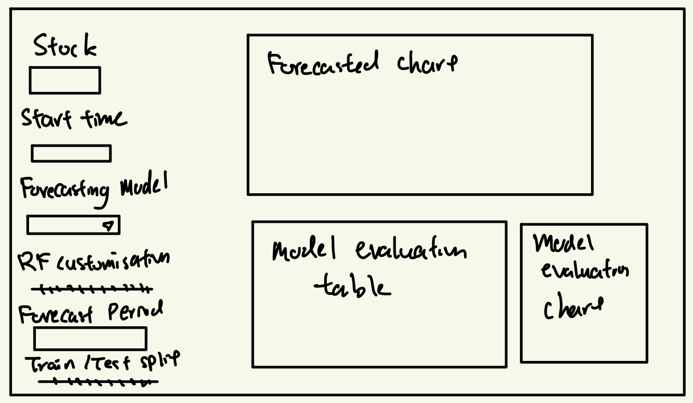

# 1. Introduction

Forecasting the stock market is a very complex task that involves analyzing the movements of past stock prices to predict future trends. Although there are many other external factors eg. political, economical, global events etc that could heavily impact the stock prices, our goal here is to only find the best prediction based on previous past trends.

This guide will provide an in-depth approach to stock market forecasting using R and the Modeltime framework, which integrates time series models with machine learning methods.

This guide aims to cover:

-   Exploratory Data Analysis (EDA) for understanding the time series data

-   Preprocessing & Feature Engineering for model improvement

-   Model Selection and Optimization, leveraging the many forecasting models we have

-   Comparative Model Evaluation to select the best predictive framework

-   Interactive Data Visualization to analyze and interpret results.

# 2. Literature Review

The forecasting of stock prices has been extensively studied in financial and computational research. According to a research by [Apoorv Yadav (2024)](https://www.researchgate.net/profile/Apoorv-Yadav-8?_tp=eyJjb250ZXh0Ijp7ImZpcnN0UGFnZSI6InB1YmxpY2F0aW9uIiwicGFnZSI6InB1YmxpY2F0aW9uIn19), the study shows that:

-   ARIMA is widely used for financial time series forecasting due to its strong statistical properties but struggles with non-stationary and high volatility

-   GARCH models extend ARIMA by modeling variance volatility making it more effective for our use case

-   Facebook Prophet is an alternative model that excels in handling seasonality and external regressors

-   LSTM have been shown to outperform statistical models in capturing long term dependencies and non-linearities

This gives us some understanding on the model options that we have and forms a great base for our task.

# 3. Getting Started

## 3.1 Importing Libraries

| Library      | Use case                            |
|--------------|-------------------------------------|
| tidymodels   | ML framework                        |
| timetk       | Time series feature engineering     |
| modeltime    | Forecasting framework               |
| quantmod     | Fetch stock data                    |
| lubridate    | Date-time manipulation              |
| plotly       | Interactive Visualization           |
| xgboost      | Gradient boosting model             |
| randomForest | Random Forest model                 |
| keras        | Deep Learning (LSTM)                |
| tidyverse    | Data Manipulation and Visualization |

```{r}
library(tidyverse)      
library(tidymodels)      
library(timetk)       
library(modeltime)       
library(quantmod)      
library(lubridate)       
library(plotly)         
library(xgboost)        
library(randomForest)   
library(keras) 
library(tidyquant)

```

## 3.2 Fetching and Preparing Stock Data

Our stock data will be retrieved from Yahoo Finance using *quantmod.* We focus on closing prices, which will serve as the primary target variable in our forecasting.

Let us start by using the tq_get() function to see how the data is structured and what columns are available.

```{r}
#| code-fold: true
#| code-summary: "Show the code"
tq_get("AAPL")
```

We will take data from the last 2 years so that our model will learn from the most up-to-date patterns and trends.

```{r}
stock_symbol <- "AAPL"
start_date <- Sys.Date() - 730
end_date <- Sys.Date()

stock_data <- tq_get(stock_symbol, from= start_date, to= end_date)

stock_tbl <- stock_data %>%
  select(date, close) %>%
  rename(Date= date, Value= close)
```

# 4. Exploratory Data Analysis (EDA)

## 4.1 Summary Statistics

```{r}
#| code-fold: true
#| code-summary: "Show the code"
summary(stock_tbl)
```

::: callout-note
## Insights

There seems to have a big range between the min and max, we should take this volatility into account when doing our forecasting
:::

## 4.2 Distribution

```{r}
#| code-fold: true
#| code-summary: "Show the code"
stock_tbl %>%
  ggplot(aes(x = Value)) +
  geom_histogram(fill = "blue", bins = 30, alpha = 0.7) +
  theme_minimal() +
  ggtitle("Stock Price Distribution")
```

::: callout-note
## Insights

The distribution is not normally distributed, using non-linear models would be better in our forecasting, such as LSTM, XGBoost or Prophet.
:::

## 4.3 Outliers

```{r}
#| code-fold: true
#| code-summary: "Show the code"
stock_tbl %>%
  ggplot(aes(y = Value)) +
  geom_boxplot(fill = "red", alpha = 0.5) +
  theme_minimal() +
  ggtitle("Stock Price Outliers")
```

::: callout-note
# Insights

There are no extreme outliers which is good but as mentioned above the IQR is large which suggests stock price fluctuations
:::

## 4.4 Time Series Decomposition

```{r}
#| code-fold: true
#| code-summary: "Show the code"
stock_tbl %>%
  plot_stl_diagnostics(Date,Value)

stock_tbl %>%
  mutate(Rolling_Avg = rollmean(Value, k=30, fill =NA)) %>%
  ggplot(aes(x=Date)) +
  geom_line(aes(y=Value),color="blue")+
  geom_line(aes(y=Rolling_Avg), color="red")+
  theme_minimal()
```

::: callout-note
## Insights

There is a clear upward trend with fluctuations, meaning a trend following model would work well like ARIMA, XGBoost. There is also seasonality detected as we see some periodic effects so we can also consider SARIMA, Prophet.
:::

## 4.5 Correlation of Time Series Features

This step is to help us identify which date components (e.g month, week, quarter) are most correlated with stock prices, which will be useful when building our forecasting model.

```{R}
library(ggcorrplot)

sig_tbl <- stock_tbl %>%
  tk_augment_timeseries_signature() %>%
  select(-Date)

numeric_tbl <- sig_tbl %>%
  select(where(is.numeric)) %>%
  select(where(~ sd(.x, na.rm = TRUE) > 0))

numeric_tbl$Value <- stock_tbl$Value

corr_with_value <- cor(numeric_tbl, use = "complete.obs")[, "Value", drop = FALSE]

corr_df <- as.data.frame(corr_with_value) %>%
  rownames_to_column("feature") %>%
  filter(feature != "Value")

ggplot(corr_df, aes(x = reorder(feature, Value), y = Value)) +
  geom_col(fill = "#1f77b4") +
  coord_flip() +
  labs(
    title = "Correlation of Time Features with Stock Price (Value)",
    x = "Feature",
    y = "Correlation with Value"
  ) +
  theme_minimal()

```

# 5. Preparing Data for model building

We divide the data set into training (80%) and testing (20%) sets, as general preparation for training predictive models. This ensures the model generalizes well to unseen data, prevent data leakage and facilitate a fair comparison among models.

```{r}
#| code-fold: true
#| code-summary: "Show the code"
splits <- initial_time_split(stock_tbl, prop=0.8)

stock_tbl %>%
  mutate(Split = ifelse(Date<max(training(splits)$Date), "Training", " Testing")) %>%
                        ggplot(aes(x=Date,y=Value,color=Split))+
                          geom_line() +
                          theme_minimal() +
                          ggtitle("Training vs Testing Data Split")
```

::: callout-note
## Insights

As the testing split takes the more recent price where fluctuations are present, we need to consider models that adapt to new conditions like LSTM. The training set captures long-term trends so ARIMA, XGBoost will work well.
:::

# 6. Building Forecasting Models

## 6.1 ARIMA Model

We initialize an ARIMA model using arima_reg() and then train it using the training data where Value is the target variable and Date is the independent variable.

This model analyzes historical stock prices to identify trends and patterns, assuming that future prices are linearly dependent on past observations.

```{r}
model_arima <- arima_reg() %>%
  set_engine("auto_arima") %>%
  fit(Value ~ Date, data = training(splits))
```

::: callout-note
## Note

The result mentions frequency = 5 observations per 1 week, indicating 5 trading days per week
:::

## 6.2 Prophet Model

For the Prophet Model, we require some data preprocessing, we need to extract time based features from the Date column, normalize numeric date-based features, apply fourier transformation to capture seasonality and convert categorical into dummy variables. This is because Prophet handles seasonality and trend shifts in time series data.

We use prophet_reg() to initialize the model, workflow() to combine our preprocessed recipe and train it with our training split.

```{r}
recipe_spec <- recipe(Value ~ Date, training(splits)) %>%
  step_timeseries_signature(Date) %>%
  step_rm(contains("am.pm"), contains("hour"), contains("minute"),
          contains("second"), contains("xts"), contains("half"),
          contains(".iso")) %>%
  step_normalize(Date_index.num) %>%
  step_fourier(Date, period = 12, K = 1) %>%
  step_dummy(all_nominal())

workflow_fit_prophet <- workflow() %>%
  add_model(
    prophet_reg() %>% set_engine("prophet")
  ) %>%
  add_recipe(recipe_spec) %>%
  fit(training(splits))
```

## 6.3 XGBoost

For the XGBoost model, we do some data preprocessing as well, we extract useful features from the Date column such as year, month, day of year and week, we convert categorical into dummy variables and normalize numeric predictors.

We define the gradient boosting tree for regression tasks and use workflow() to combine our model and recipe.

```{r}
recipe_spec_parsnip <- recipe(Value ~ Date, data = training(splits)) %>%
  step_date(Date, features = c("year", "month", "doy", "week")) %>% 
  step_dummy(all_nominal_predictors()) %>%  
  step_normalize(all_numeric_predictors()) %>%  
  step_rm(Date) 
prepped_recipe <- prep(recipe_spec_parsnip)

train_processed <- juice(prepped_recipe)

X_train <- train_processed %>% select(-Value)
y_train <- train_processed$Value

sapply(X_train, class)
workflow_fit_xgboost <- workflow() %>%
  add_model(boost_tree(mode = "regression") %>% set_engine("xgboost")) %>%
  add_recipe(recipe_spec_parsnip) %>%
  fit(training(splits))


```

## Variable Importance

```{R}
library(vip)

workflow_fit_xgboost %>%
  extract_fit_parsnip() %>%
  vip(num_features = 15) +
  ggtitle("XGBoost Feature Importance")

```

::: callout-note
## Insights

According to our XGBoost model, the year and seasonality of the year (day-of-year) have the strongest influence on stock price, while specific month dummies have little predictive value.
:::

## 6.4 ETS

The ETS model determines whether the time series has error, trend and seasonality, we define this by using exp_smoothing().

```{r}
model_ets <- exp_smoothing() %>%
  set_engine("ets") %>%
  fit(Value ~ Date, data = training(splits))

```

## 6.5 Random Forest

For random forest, we do some preprocessing, we extract features from date, convert categorical variables to dummy and normalize numerical features.

We define the model by using rand_forest(), with 500 trees and 50 minimum samples required to make a split in the tree.

```{R}
recipe_rf <- recipe(Value ~ Date, data = training(splits)) %>%
  step_date(Date, features = c("year", "month", "dow")) %>% 
  step_dummy(all_nominal_predictors()) %>%  
  step_normalize(all_numeric_predictors()) 

model_rf <- rand_forest(
  mode = "regression", 
  trees = 500,          
  min_n = 50            
) %>%
  set_engine("ranger")

workflow_fit_rf <- workflow() %>%
  add_model(model_rf) %>%
  add_recipe(recipe_rf) %>%
  fit(training(splits))


```

# 7. Comparing Models

We start by combining all models into modeltime framework.

```{R}
calibrated_tbl <- modeltime_table(
  model_arima,
  workflow_fit_prophet,
  workflow_fit_xgboost,
  model_ets,
  workflow_fit_rf
) %>%
  modeltime_calibrate(new_data = testing(splits))


```

## Plotting our forecast models

```{R}
#| code-fold: true
#| code-summary: "Show the code"
calibrated_tbl <- calibrated_tbl %>%
  mutate(.model_desc = case_when(
    .model_id ==1 ~ "ARIMA",
    str_detect(.model_desc, "RANGER") ~ "Random Forest",
    TRUE ~ .model_desc
  ))
forecast_tbl <- calibrated_tbl %>%
  modeltime_forecast(new_data = testing(splits), actual_data = stock_tbl)

plot_modeltime_forecast(forecast_tbl, .interactive = TRUE)

```

::: callout-note
## Insight

From the visualization we can identify XGBoost and Prophet provide more realistic and adaptive trends.

ARIMA & ETS are more static and this may be due to not being able to handle rapid changes well.

Random Forest shows instability as the model may not have been calibrated well.
:::

## Model Evaluation

```{R}
#| code-fold: true
#| code-summary: "Show the code"
calibrated_tbl %>%
  modeltime_accuracy() %>%
  table_modeltime_accuracy(.round_digits = 3)
```

::: callout-note
## Insights

According to the numbers it seems that ETS and Prophet are best models in this case with the lowest error.
:::

```{r}
#| code-fold: true
#| code-summary: "Show the code"
model_residuals <- calibrated_tbl %>%
modeltime_residuals()
model_residuals %>%
  plot_modeltime_residuals(.type = "timeplot")


```

```{R}
#| code-fold: true
#| code-summary: "Show the code"
model_residuals %>%
  plot_modeltime_residuals(.type = "acf")
```

```{r}
#| code-fold: true
#| code-summary: "Show the code"
model_residuals %>%
  plot_modeltime_residuals(.type = "seasonality")
```

::: callout-tip
## Thinking

It might not be a good idea to just include XGBoost or Random Forest but giving a variety of forecasting models options into our application may allow for better decision making.
:::

## Visualizing Comparison

```{r}
#| code-fold: true
#| code-summary: "Show the code"
accuracy_tbl <- calibrated_tbl %>%
  modeltime_accuracy() %>%
  pivot_longer(cols = c(mae, rmse, mape),
               names_to = "Metric", values_to = "Value") %>%
  mutate(.model_desc = case_when(
    .model_desc == "PROPHET W/ REGRESSORS" ~ "Prophet",
    .model_desc == "1_UPDATE: ARIMA(0,1,0)(0,1,1)[5] WITH DRIFT" ~ "ARIMA",
    .model_desc == "4_ETS(M,N,N)" ~ "ETS",
    TRUE ~ .model_desc  
  ))

ggplot(accuracy_tbl, aes(x = reorder(.model_desc, Value), y = Value, fill = Metric)) +
  geom_col(position = "dodge", width = 0.6) +  
  facet_wrap(~ Metric, scales = "free_y") +  
  coord_flip() +  # Flip for readability
  scale_fill_manual(values = c("mae" = "#E74C3C", "mape" = "#2ECC71", "rmse" = "#3498DB")) + 
  labs(title = "Model Performance Comparison",
       x = "Model",
       y = "Metric Value") +
  theme_minimal(base_size = 14) +  
  theme(axis.text.x = element_text(angle = 0, vjust = 0.5, hjust=1),
        legend.position = "bottom") 

```

## Projecting Forward

We now plot a 2 month projection forward using our models. This will be the forecast used in our shiny app, where users can calibrate how many months ahead they want to visualize, of course with a cap.

```{R}
#| code-fold: true
#| code-summary: "Show the code"

calibrated_tbl %>%
  modeltime_refit(stock_tbl) %>%
  modeltime_forecast(h = "2 months", actual_data = stock_tbl) %>%

  plot_modeltime_forecast(.interactive = TRUE)
```

# 8. User Interface


